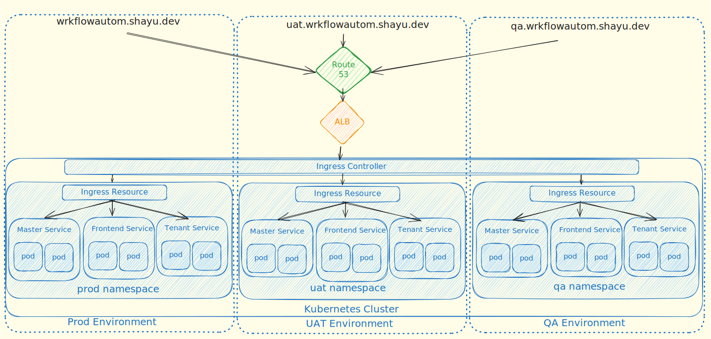

# IAC Deployment Demonstration

NOTE: IGNORE THIS DOC, NOT PROPERLY YET, IS PLACEHOLDER

**Single-command** deployment of a fleet of microservices per environment with CI/CD included.

Avoid click-ops that take teams an **entire day** to set up a new environment with microservices, and can easily be fat-fingered (and often is).

Bonus: Environment variable management.

Via Pulumi (better than Terraform imo), Helm, Jenkins and Kubernetes.

This is the AWS version.

## Why

The goal is to avoid using the console and manually managing a lot of yaml files. They're very tedious to  redo for every new setup and very, very, **very** error-prone.

What would be better is a single declarative source-of-truth. This allows for very reproducible setups, and it's very easy to tear down resources as well.

## What

We will have a single EKS cluster, and each namespace corresponds to an **environment**. Eg prod, uat, qa, etc.

Additionally, each environment's UI will have its own subdomain (or non, like prod won't).

Depending on subdomain, the ingress controller (kubernetes entry point) will route the request to the namespace. From there, based on the ingress resource of that namespace (configuration rules), the request will be routed to that specific service (which will further route it to whichever pod is best).

Standard kubernetes stuff.

## How

For documentation of specifics and exact approach, refer to:
- [Deployment design readme](./documentation/Deployment-Design.md) for understanding how environments are created.
- [CI/CD design readme](./documentation/CICD-Design.md) for understanding how the CI/CD pipeline works.
- [Secrets management readme](./documentation/Secrets-Design.md) for how to manage environment variables easily.

## Where

Make a root user on AWS and then an administrator. Log in with latter on aws-cli, and deploy on cloud.

The service repositories used for this are these:
- https://github.com/xylarshayu/infra-demo-ui
- https://github.com/xylarshayu/infra-demo-tenant-level
- https://github.com/xylarshayu/infra-demo-master-level

To test these repositories locally, clone the above. Then refer to `./local-deploy` to run the microservices locally with docker-compose.